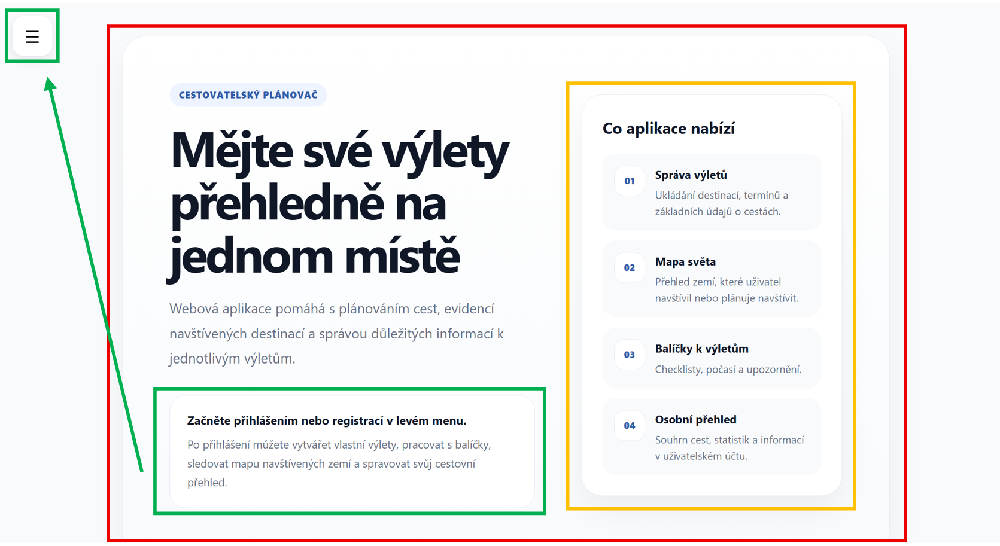

# Dokumentace webové aplikace pro plánování výletů

## O aplikaci

Tato dokumentace popisuje webovou aplikaci určenou pro plánování, evidenci a správu výletů vytvořenou v rámci bakalářské práce na Technické univerzitě v Liberci.

Aplikace umožňuje vytvářet výlety, ukládat k nim základní informace o destinaci a termínu, rozšiřovat je pomocí doplňkových balíčků a sledovat důležité informace, jako jsou notifikace nebo statistiky.

Hlavním cílem aplikace je nabídnout jedno přehledné místo, kde můžete své cesty jednoduše organizovat - jak při plánování, tak i během samotného cestování.

---

## Pro koho je dokumentace určena?

Dokumentace je určena především běžným uživatelům aplikace.

Nepředpokládá se znalost technických detailů. Text je zaměřen na praktické používání aplikace, vysvětlení jednotlivých funkcí a konkrétní pracovní postupy.

---

## Co aplikace umožňuje

Pomocí aplikace můžete:

- vytvořit účet a přihlásit se → [Registrace a přihlášení](navody/registrace-a-prihlaseni.md)
- vytvořit nový výlet → [Vytvoření výletu](navody/vytvoreni-vyletu.md)
- upravit nebo smazat výlet → [Úprava výletu](navody/uprava-vyletu.md) / [Smazání výletu](navody/smazani-vyletu.md)
- spravovat své výlety → [Moje výlety](navody/moje-vylety.md)
- zobrazit výlety v kalendáři → [Kalendář](navody/pouziti-kalendare.md)
- sledovat statistiky → [Statistiky](navody/zobrazeni-statistik.md)
- pracovat s balíčky → [Šablony balíčků](navody/sablony-balicku.md)
- upravit svůj profil nebo změnit heslo → [Profil](navody/uprava-profilu.md)

---

## Rychlá pomoc

Potřebujete rychle něco najít?

- vytvoření účtu -> [Registrace](navody/registrace-a-prihlaseni.md#registrace)
- přihlášení -> [Přihlášení](navody/registrace-a-prihlaseni.md#prihlaseni)
- změna hesla -> [Změna hesla](navody/uprava-profilu.md)
- vytvoření výletu -> [Vytvoření výletu](navody/vytvoreni-vyletu.md)
- přidání balíčku -> [Šablony balíčků](navody/sablony-balicku.md)

---

## Struktura dokumentace

Dokumentace je rozdělena do několika částí, které na sebe logicky navazují.

### Základní pojmy

V této části se seznamte se základními pojmy aplikace.

- [Co je výlet?](koncept/vylet.md)
- [Co jsou balíčky?](koncept/balicky.md)

---

### Aplikace

Tato část obsahuje praktické návody pro práci s aplikací.

Najdete zde postupy, krok za krokem::

- [Registraci a přihlášení](navody/registrace-a-prihlaseni.md)
- [Vytvoření](navody/vytvoreni-vyletu.md), [úprava](navody/uprava-vyletu.md), [smazání výletu](navody/smazani-vyletu.md)
- [Používání kalendáře](navody/pouziti-kalendare.md)
- [Sledování statistik](navody/zobrazeni-statistik.md)
- [Změna uživatelského jména](navody/uprava-profilu.md), [změna hesla](navody/uprava-profilu.md)

Jednotlivé návody jsou doplněny obrázky pro lepší orientaci.

---

## Spuštění aplikace

Aplikace je dostupná na následujícím odkazu:
[Vstoupit do aplikace](https://muj-planovac-vyletu.vercel.app)

Po otevření se ocitnete na **Úvodní stránce**, která slouží jako výchozí bod pro práci s aplikací.

---

Uprostřed se nachází úvodní text, který stručně popisuje účel aplikace.

**Pod tímto textem** (zeleně zvýrazněná oblast) je umístěna výzva, která Vás navede k přihlášení nebo registraci.

V **levé horní** části stránky se nachází tlačítko pro otevření menu.

Otevřete menu a pokračujte dle návodu:
-> [Registrace a přihlášení](navody/registrace-a-prihlaseni.md)

---

V **pravé části** stránky (žlutě zvýrazněná oblast) se nachází přehled hlavních funkcí aplikace.