# Detail výletu

Na této stránce najdete všechny zadané informace o vytvořené cestě.

Dostanete se sem třema způsoby:

1) ze stránky **Moje výlety** (oranžově zvýrazněná oblast) – klikněte na kartu vybraného výletu

2) ze stránky **Kalendář** (zeleně zvýrazněná oblast) – klikněte na konkrétní výlet v kalendáři

3) ze stránky **Kalendář** – klikněte na konkrétní výlet v kartě *Nejbližší cesty*

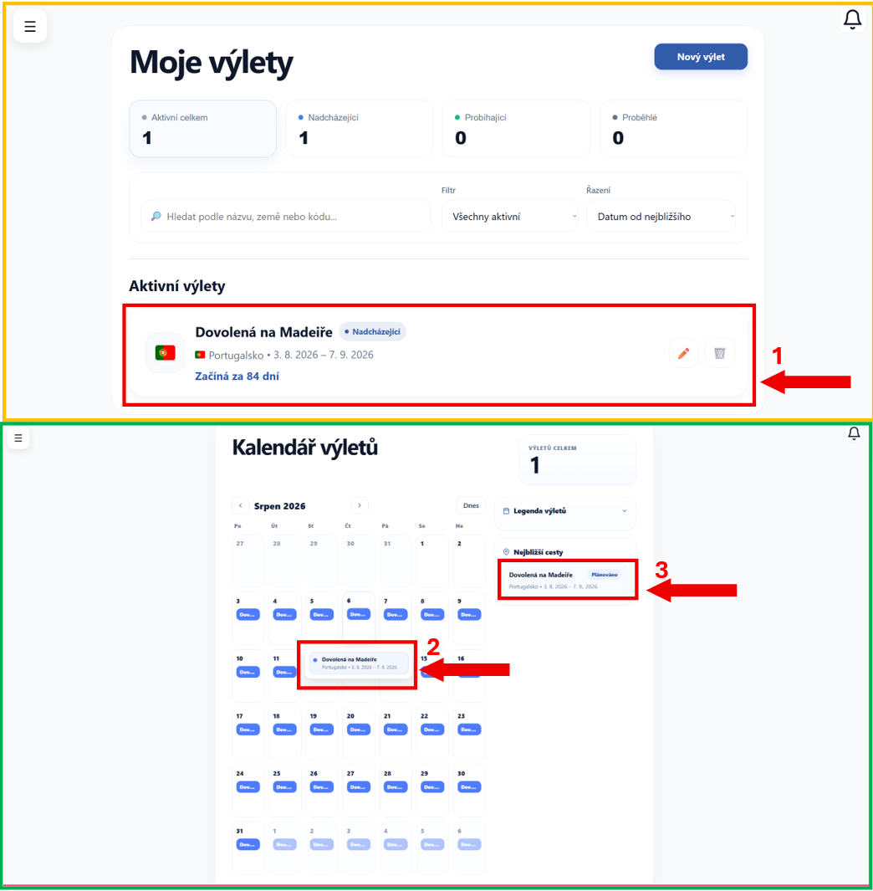

---

## Rozvržení stránky

Detail výletu obsahuje hned několik částí.

---

### Základní informace o výletu

V horní části stránky se zobrazuje hlavní přehled výletu.

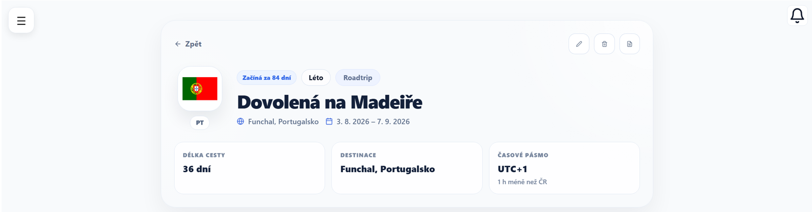

Najdete zde:

- **informaci o tom, za jak dlouho výlet začíná**
- **v jaké je ročním období**
- **kategorii výletu**
- **název výletu**
- **stát a město**
- **termín cesty**
- **délku cesty**
- **časové pásmo**

V **pravé horní** části jsou ikony pro práci s výletem:

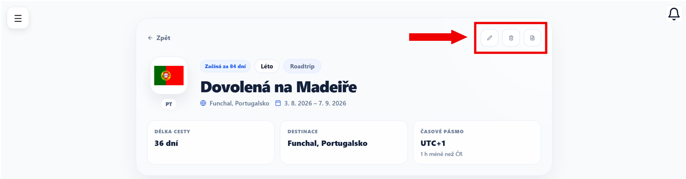

- **✏️** – klikněte na ikonu a **upravte** výlet -> [Upravit výlet](uprava-vyletu.md)
- **🗑️** – klikněte na ikonu a **smažte** výlet -> [Smazat výlet](smazani-vyletu.md)
- **📄** – klikněte na ikonu a **exportujte** výlet do PDF

---

### Mapa destinace

**Níže** se zobrazuje poloha vybraného města na mapě.

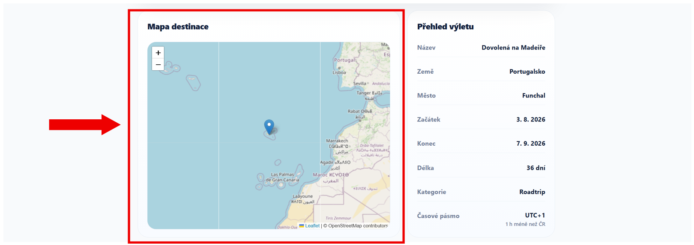

---

### Přehled výletu

**Vedle** mapy se nachází stručný přehled zadaných údajů.

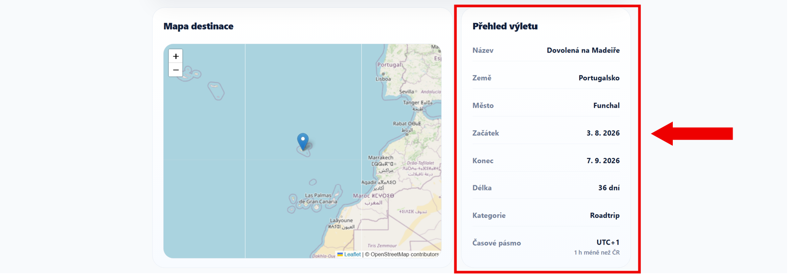

- **Název** - název výletu
- **Země** - stát, do kterého cestujete
- **město** -  konkrétní město v destinaci
- **Začátek a konec výletu** - termín, kdy výlet probíhá
- **Délka** - celkový počet dní strávených na cestě
- **Kategorie** - typ výletu
- **Časové pásmo** - čas v destinaci a případný rozdíl oproti ČR

---

### Měnová kalkulačka

Měnová kalkulačka umožňuje převést částku mezi **českou korunou** a **měnou vybrané destinace**.

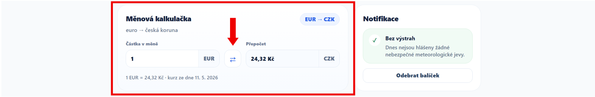

Zadejte částku a použijte převod pro rychlou orientaci v cenách.

---

### Notifikace

**Vedle** měnové kalkulačky, v části **Notifikace** se zobrazují upozornění na meteorologické jevy.

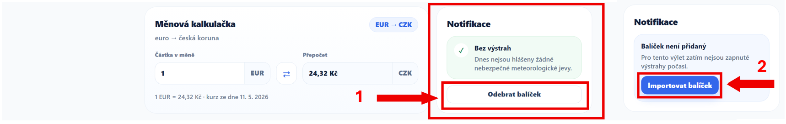

1. Pokud balíček nechcete používat, odeberte jej pomocí tlačítka **Odebrat balíček**.
2. Pokud balíček  není přidaný, klikněte na tlačítko **Importovat balíček**.

---

### Počasí

Následuje sekce **Počasí**, která zobrazuje předpověď pro zvolenou destinaci.

Najdete zde:

- předpověď na následující hodiny
- přehled počasí na další dny

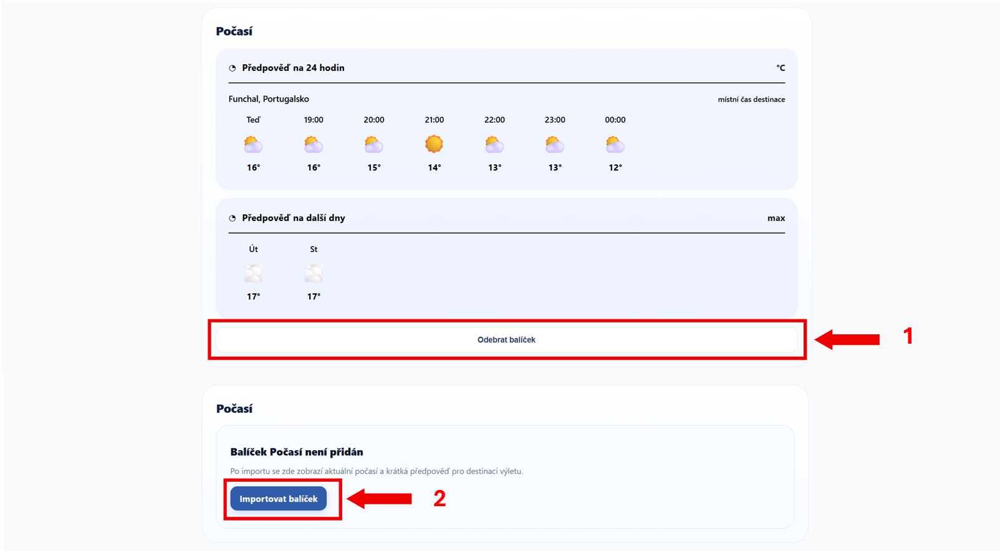

1. Pokud balíček nechcete používat, odeberte jej pomocí tlačítka **Odebrat balíček**.
2. Pokud balíček není přidaný, klikněte na tlačítko **Importovat balíček**.

---

### Checklist

Předposlední částí je **Checklist**, který umožňuje vytvářet a upravovat seznamem věcí, které si chcete zabalit.

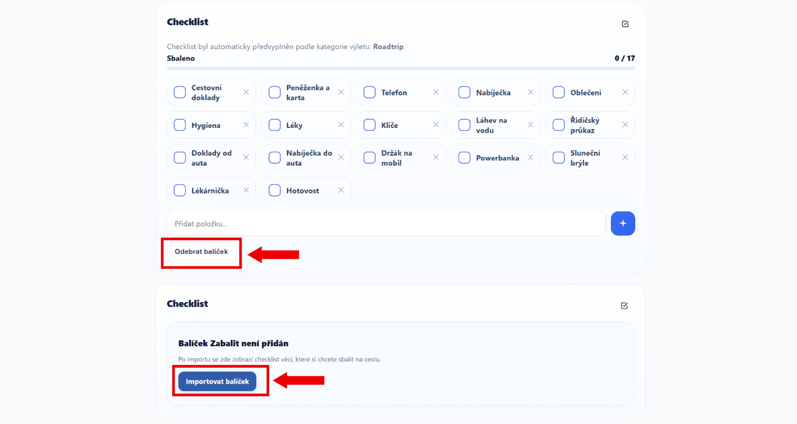

1. Pokud balíček nechcete používat, odeberte jej pomocí tlačítka **Odebrat balíček**.
2. Pokud balíček není přidaný, klikněte na **Importovat balíček**.

---

### Práce s položkami

1. Klikněte na **checkbox** u položky a označte ji jako sbalenou
2. Jakmile položku označíte, automaticky se započítá do celkového přehledu.
3. Opětovným kliknutím položku odznačte

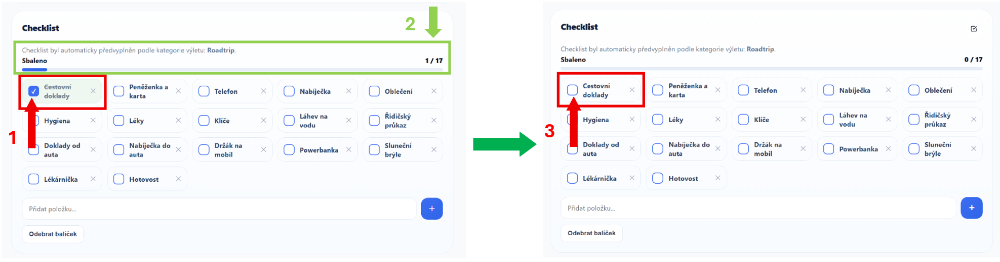

---

### Přidání nové položky

Klikněte do pole **Přidat položku...**, napište název a potvrďte tlačítkem **+**

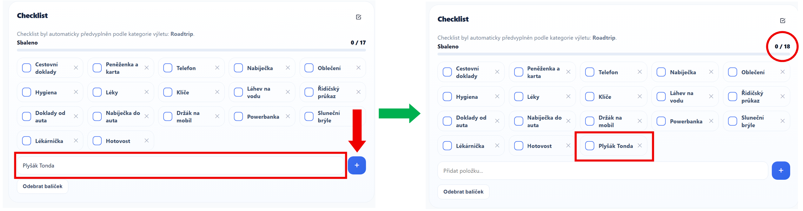

Nová položka se ihned zobrazí v seznamu.

---

### Smazání položky

U každé položky se nachází ikona **✕**.

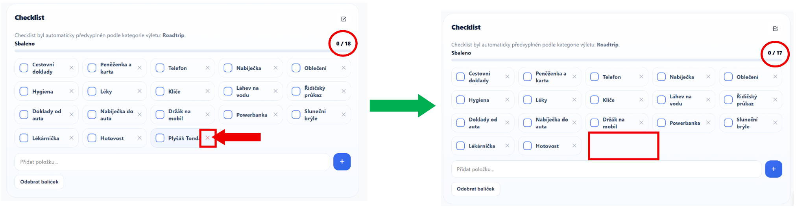

Klikněte na ni a položku odeberte ze seznamu.

---

!!! tip "Tip"
    Checklist si přizpůsobte podle sebe - přidejte vlastní položky a mějte jistotu, že na nic nezapomenete.

---

### Poznámky

Poslední částí jsou **Poznámky**. Zde si zapisujte vlastní informace k výletu.

Přidejte například:

- důležité adresy
- připomínky
- informace k ubytování
- vlastní poznámky k cestě

---

### Přidání poznámky

 Klikněte na pole **Přidat poznámku...** a zapište potřebné informace.

 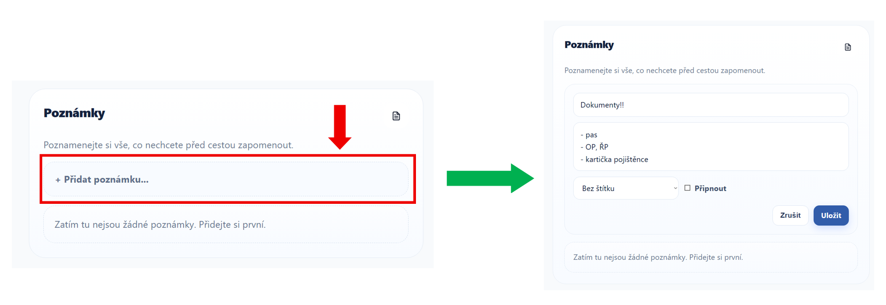

---

### Připnutí poznámky

Klikněte na  **Připnout** a připněte důležitou poznámku nahoru.

 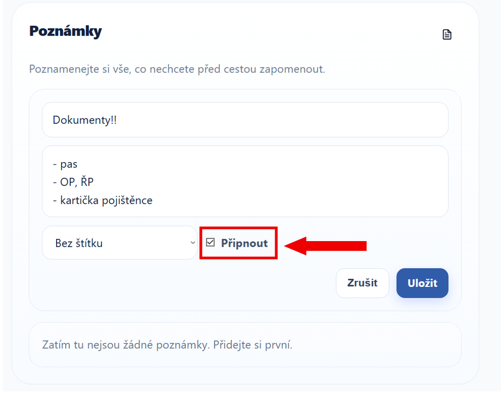

Připnuté poznámky se zobrazují vždy jako první.

---

### Barvy poznámek

**Napravo** od *chesklistu připnout* vyberte barvu poznámky a rozlište si jednotlivé informace.

 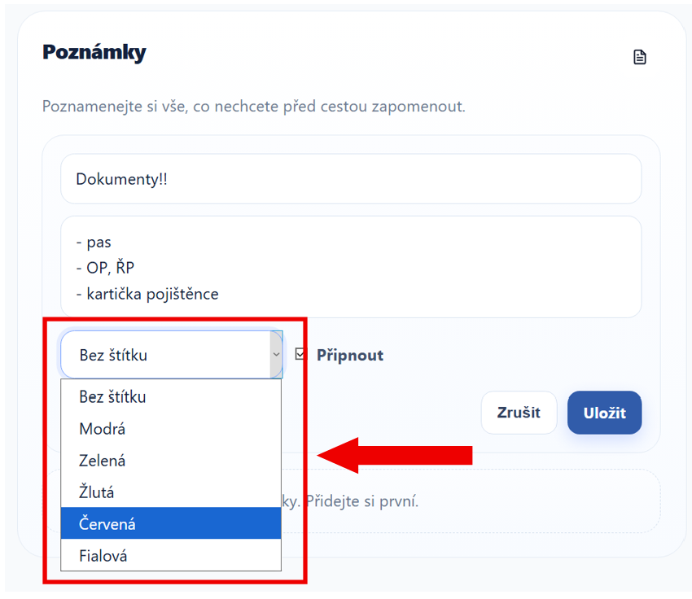

Barvy můžete rozdělit dle libosti, například pro:

- důležité informace
- upozornění
- osobní poznámky

Poznámku uložte tlačítkem **Uložit**

 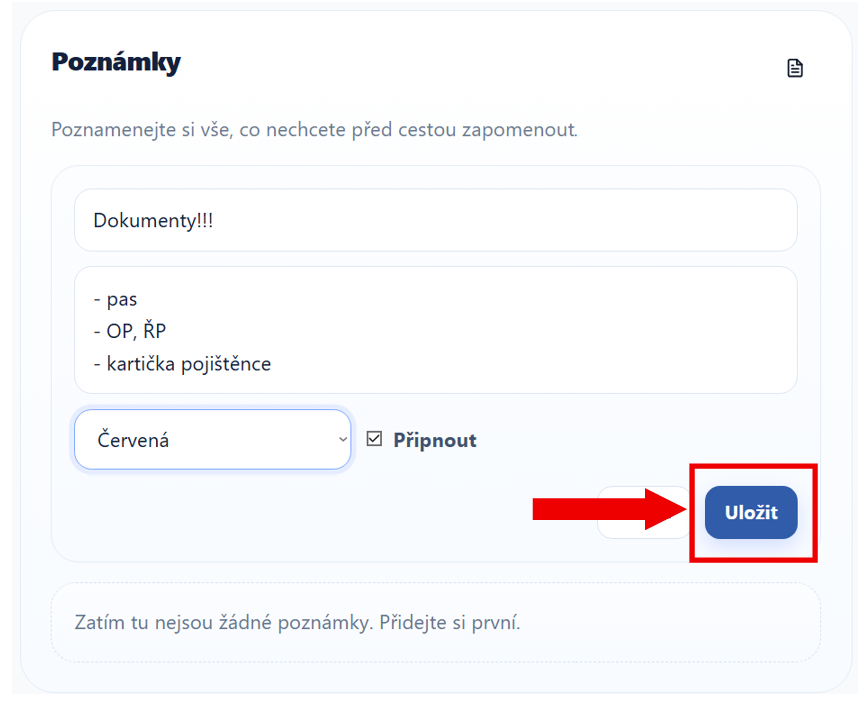

---

### Úprava poznámky

1. Klikněte na ikonu **tužky**
2. Upravte obsah poznámky
3. Změny potvrďte tlačítkem **Uložit**

 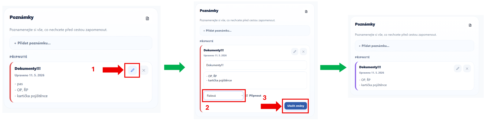

---

### Smazání poznámky

U každé poznámky se nachází ikona **✕**.

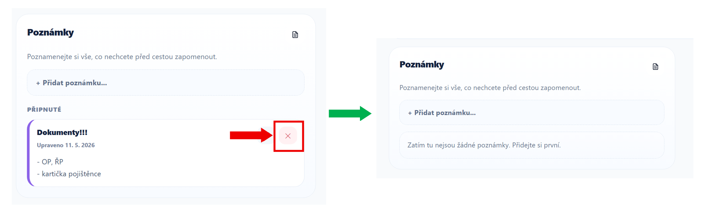

Klikněte na ni a poznámku odeberte.

---

!!! tip "Tip"
    Detail výletu používejte jako hlavní místo pro práci s konkrétní cestou. Najdete zde informace o destinaci, počasí, poznámky, checklist i další doplňkové funkce.