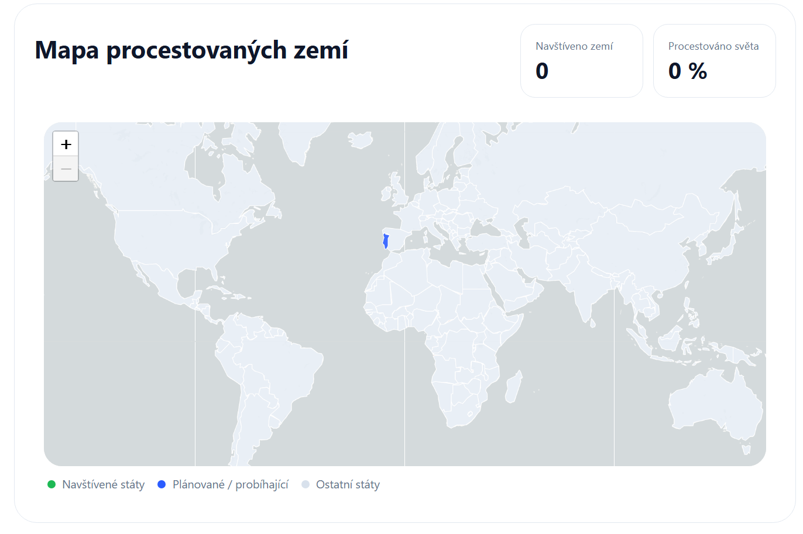

# Domovská stránka

Domovská stránka je první obrazovka, kterou uvidíte po přihlášení do aplikace.
Kdykoliv se na ni můžete vrátit přes menu, konkrétně pomocí záložky **Domů**.

---

## Rozvržení stránky

Najdete zde několik přehledných sekcí, které vám pomohou rychle se zorientovat.

---

### Přehled nejbližšího výletu

V **levé horní části** stránky (oranžově zvýrazněná oblast) se nachází přehled nejbližšího výletu:

- název výletu
- informace o tom, za jak dlouho začíná
- datum nejbližšího termínu

### Naplánovat výlet

Níže se nachází tlačítko **Naplánovat výlet**.
Klikněte na něj a přejděte na -> [Vytvoření výletu](vytvoreni-vyletu.md)

---

### Odpočet do výletu

V **pravé horní části stránky** (fialově zvýrazněná oblast) se nachází odpočet, který ukazuje, kolik dní a hodin zbývá do začátku nejbližšího výletu.

---

### Mapa procestovaných zemí

Ve **střední části stránky** (modře zvýrazněná oblast) se nachází mapa světa.

Ta poskytuje vizuální přehled o destinacích:

- navštívené země
- plánované nebo probíhající cesty

---

### Statistiky

Nad mapou se zobrazují základní statistiky, které se aktualizují podle Vašich výletů:

- **Navštíveno zemí** - počet navštívených zemí
- **Procestováno světa** - kolik procent světa máte procestováno
