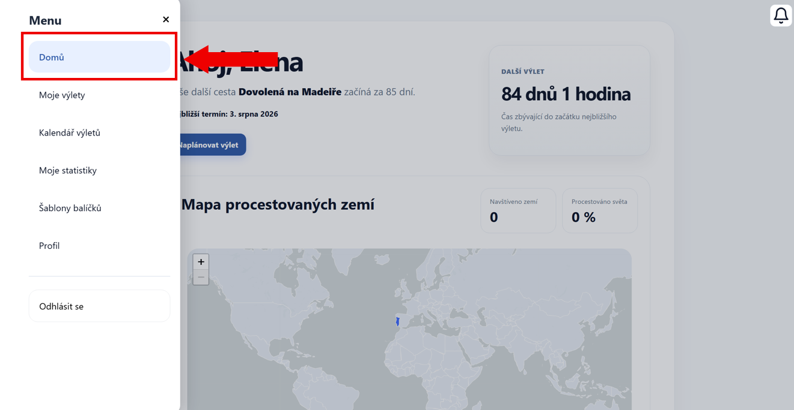
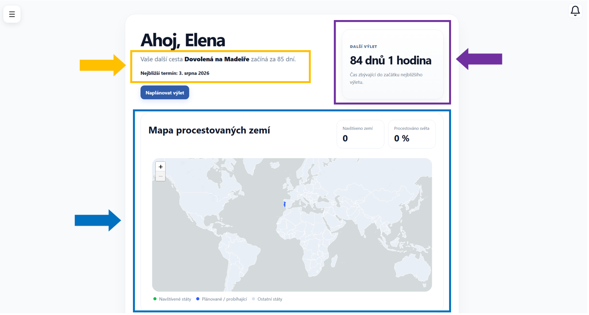

# Domovská stránka

Domovská stránka je první obrazovka, kterou uvidíte po přihlášení do aplikace, případně se na ni dostanete z menu, konkrétně
záložka **Domů**.

---

## Rozvržení stránky

Na této stránce najdete několik sekcí, které Vám umožní rychlý přehled.

### Přehled nejbližšího výletu

V **horní části vlevo (oranžově zvýrazněná oblast)** se nachází přehled vašeho nejbližšího výletu.

Zobrazuje se zde:

- název výletu
- informace o tom, za jak dlouho začíná
- datum nejbližšího termínu

Pod ní se nachází tlačítko **Naplánovat výlet**, které Vás přesměruje na → [Vytvoření výletu](vytvoreni-vyletu.md)

---

### Odpočet do výletu

V **horní části vpravo (fialově zvýrazněná oblast)** se nachází odpočet.

Zobrazuje, kolik dní a hodin zbývá do začátku nejbližšího výletu.

---

### Mapa procestovaných zemí

Ve **střední části stránky (modře zvýrazněná oblast)** se nachází mapa světa.

Ta zobrazuje:

- navštívené země
- plánované nebo probíhající cesty

---

### Statistiky

Vedle mapy se nachází základní statistiky:

- počet navštívených zemí
- procento procestovaného světa
