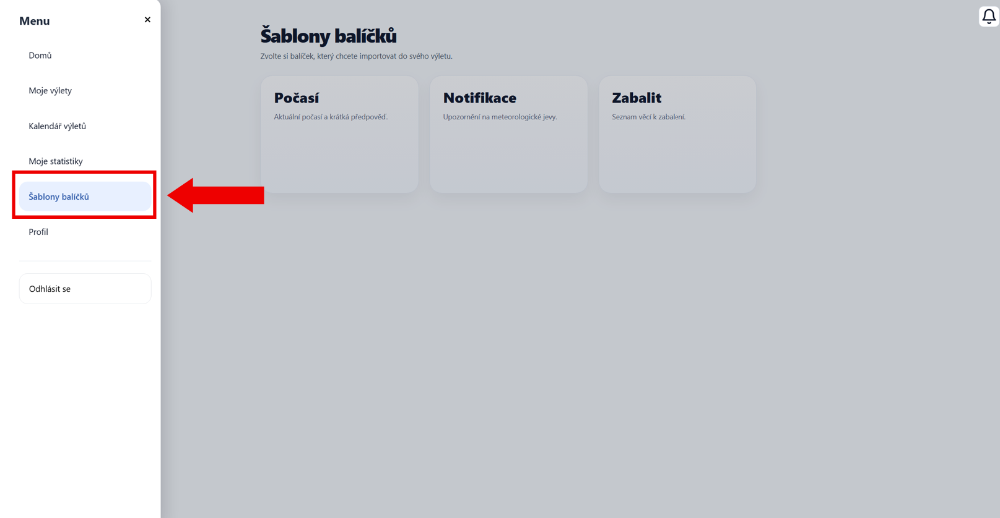
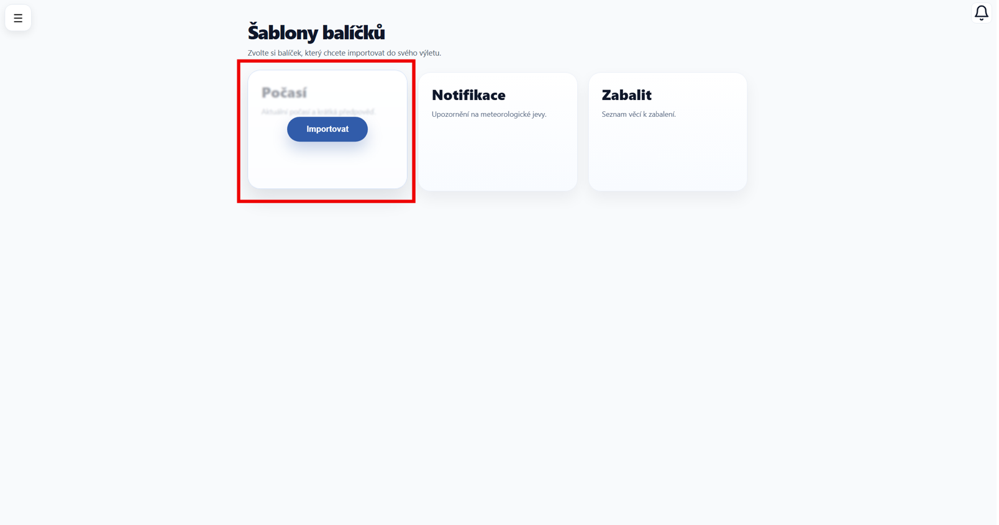
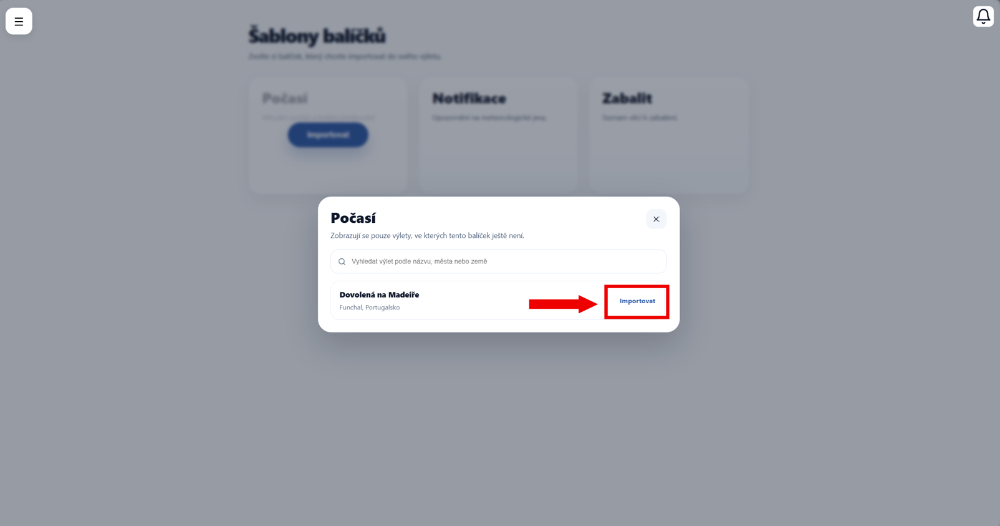

# Šablony balíčků

Na této stránce vyberte balíček, který chcete přidat do svého výletu.

Dostanete se sem přes hlavní menu aplikace, konkrétně pomocí záložky **Šablony balíčků**.

---

## Výběr balíčku

Na stránce jsou k dispozici balíčky:

- **Počasí** – zobrazte krátkou předpověď počasí
- **Notifikace** – sledujte upozornění na meteorologické jevy
- **Zabalit** – vytvořte seznam věcí k zabalení

---

## Import balíčku

Najeďte na vybraný balíček (nebo na něj klikněte) a zobrazte tlačítko **Importovat**.

Po kliknutí se otevře okno s výběrem výletu.

Vyberte výlet, do kterého chcete balíček přidat. Potvrďte tlačítkem **Importovat**.

Stejný postup použijte pro všechny balíčky, které chcete do konkrétních výletů přidat.

---

!!! info "Důležité"
    Zobrazují se pouze ty výlety, ve kterých ještě daný balíček nemáte. Nemůže tedy dojít k jeho duplicitnímu přidání.

!!! tip "Tip"
    Kombinujte balíčky podle potřeby - do jednoho výletu můžete přidat více různých funkcí!