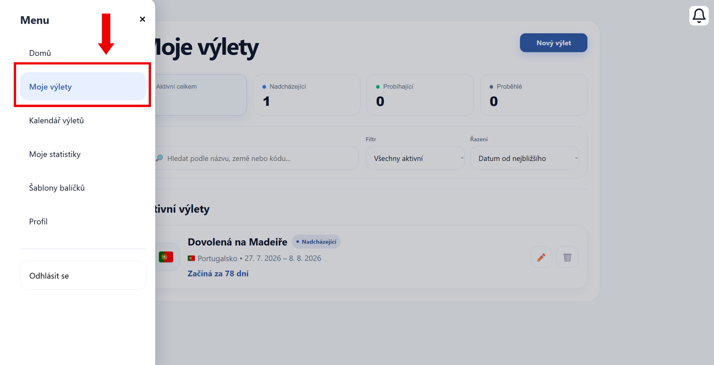
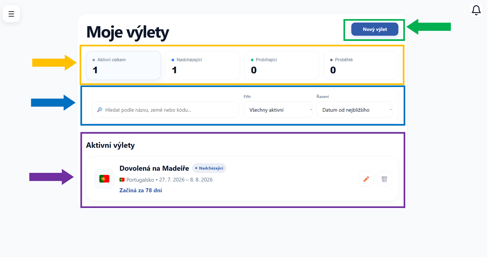
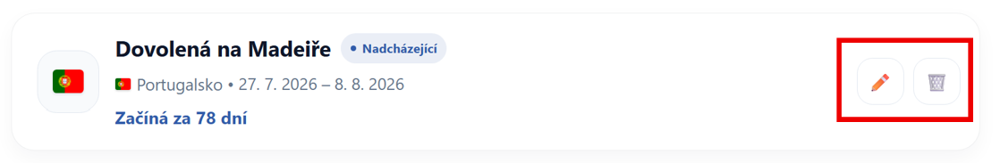

# Moje výlety

Na této stránce najdete přehled všech Vašich vytvořených výletů.

Dostanete se na ni přes hlavní menu aplikace, konkrétně pomocí záložky **Moje výlety**.

---

## Rozvržení stránky

Stránka zobrazuje seznam výletů a několik užitečných funkcí.

### Naplánovat výlet

V **pravé horní části** stránky (zeleně zvýrazněná oblast) se nachází tlačítko **Nový výlet**.
 Klikněte na něj a přejděte na -> [Vytvoření výletu](vytvoreni-vyletu.md)

---

### Filtrování výletů

**Pod nadpisem** (oranžově zvýrazněná oblast) můžete výlety filtrovat podle jejich stavu:

- **Aktivní celkem** – zobrazí všechny aktuální výlety
- **Nadcházející** – výlety, které teprve začnou
- **Probíhající** – výlety, které právě probíhají
- **Proběhlé** – již ukončené výlety

Klikněte na jednotlivé položky a zobrazte si pouze vybranou skupinu výletů.

---

### Vyhledávání a řazení výletů

Ve **střední části** stránky (modře zvýrazněná oblast) se nachází:

- **Vyhledávání** – vyhledejte výlet podle názvu, země nebo kódu
- **Filtr** – zobrazte pouze vybranou skupinu výletů
- **Řazení** – seřaďte výlety například podle data (od nejbližšího apod.)

!!! tip "Tip"
    Máte více výletů? Vyhledejte je rychle podle destinace nebo termínu.

---

Ve **spodní části** stránky (fialově zvýrazněná oblast) se nachází seznam Vašich výletů.

Každý výlet je zobrazen v samostatné kartě, která obsahuje:

- **název výletu**
- **aktuální stav**
- **destinaci**
- **termín**
- **za jak dlouho začíná**

### Upravit nebo smazat výlet

Na **pravé straně** této karty (červeně zvýrazněná oblast) se nachází ikony:

- **✏️** – klikněte na ikonu a přejděte na -> [Úprava výletu](uprava-vyletu.md)
- **🗑️** – klikněte na ikonu a přejděte na -> [Smazání výletu](smazani-vyletu.md)

---

## Otevření detailu výletu

Klikněte na kartu vybraného výletu a otevřete jeho detail.