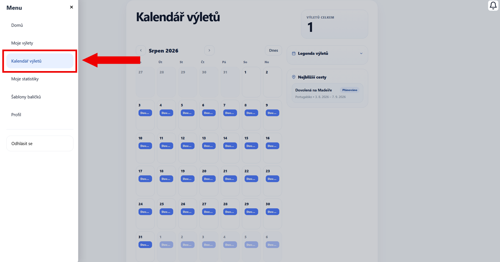
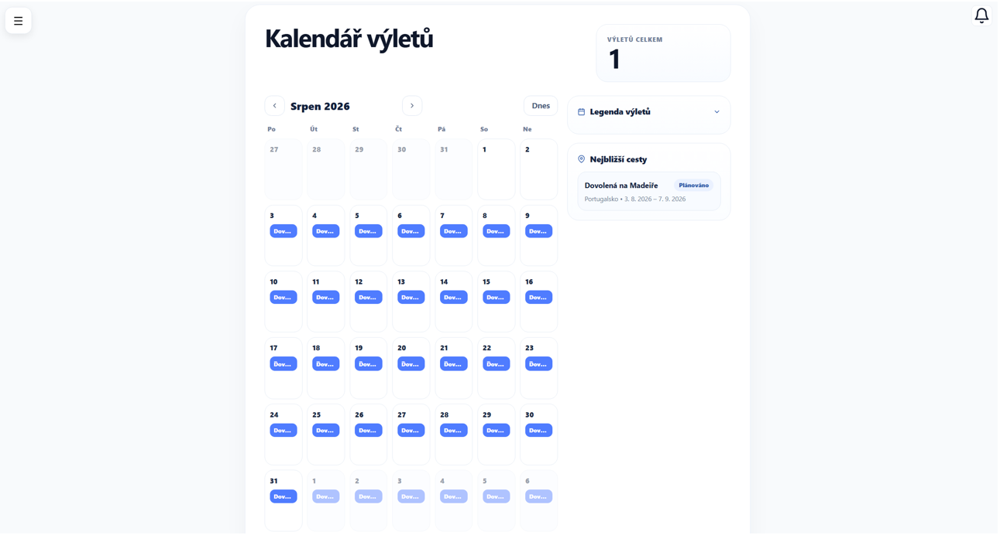
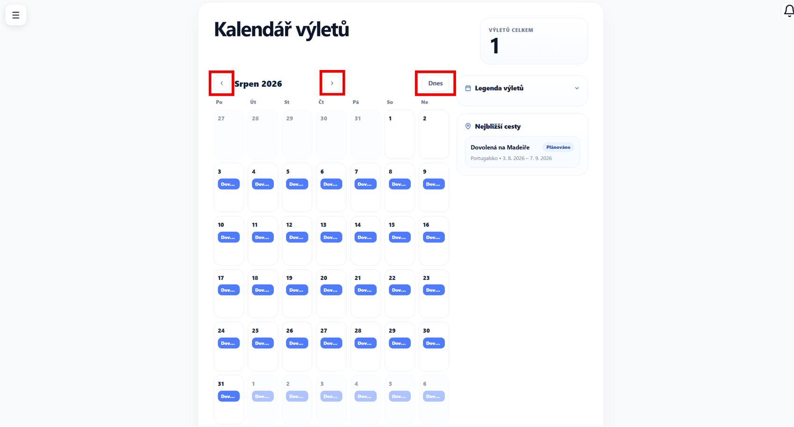
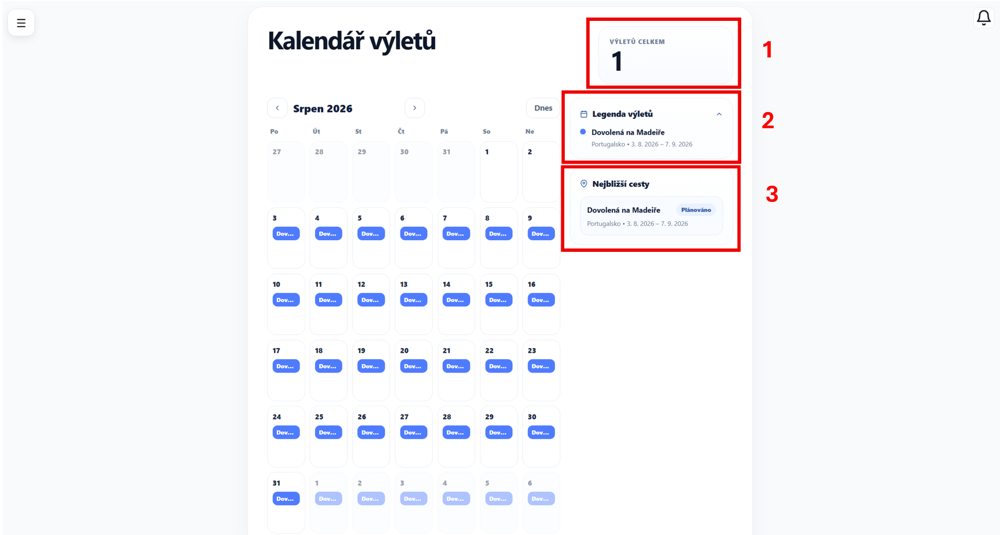
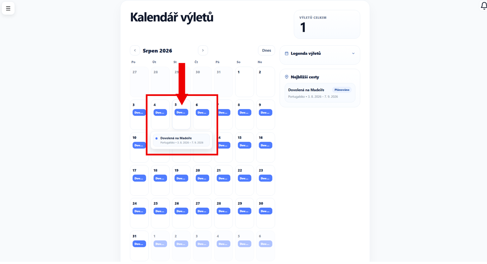
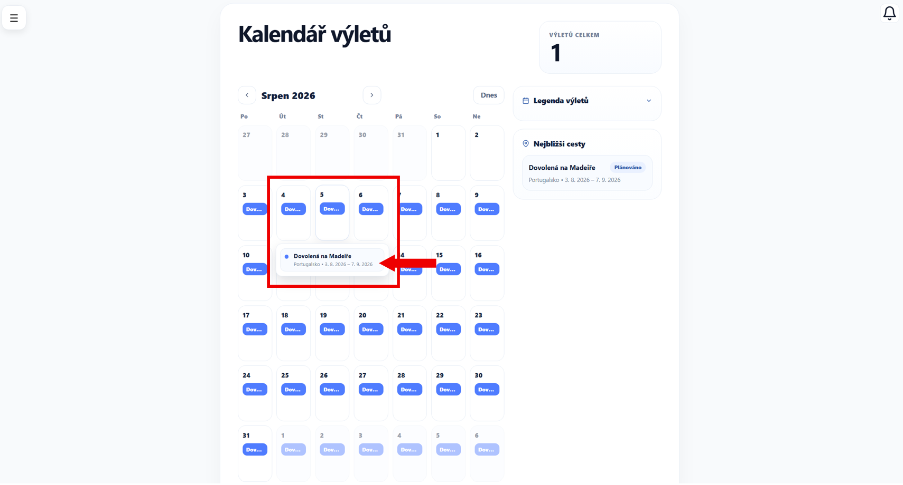

# Kalendář

Tato stránka slouží k přehlednému zobrazení všech Vašich výletů.

Dostanete se na ni přes hlavní menu aplikace, konkrétně pomocí záložky **Kalendář**.

---

## Rozvržení stránky

Na stránce se nachází měsíční kalendář, ve kterém jsou jednotlivé výlety zobrazeny přímo u odpovídajících dnů.

---

### Zobrazení výletů v kalendáři

Každý výlet je v kalendáři zobrazen formou barevného štítku s jeho názvem.

- pokud výlet trvá více dní, zobrazí se u všech dní, do kterých spadá
- díky tomu snadno uvidíte, kdy máte naplánované cesty

---

### Navigace v kalendáři

V horní části kalendáře přepínejte mezi jednotlivými měsíci:

- **šipka doleva** – zobrazte předchozí měsíc
- **šipka doprava** – zobrazte následující měsíc
- tlačítko **Dnes** – vraťte se na aktuální měsíc

---

### Pravý panel (přehled)

V **pravé části** stránky se nachází doplňující informace k Vašim výletům:

1. **Výletů celkem** - počet všech výletů
2. **Legendu výletů** - přehled konkrétních výletů a jejich termínů
3. **Nejbližší cesty**

---

### Detail dne

Klikněte na **konkrétní den** a zobrazte přehled výletů, které do tohoto dne spadají.

---

!!! tip "Tip"
    Pomocí kalendáře si rychle ověřte, zda se Vám výlety nepřekrývají.

---

### Otevření detailu výletu

Klikněte na **konkrétní výlet** v kalendáři a přejděte na -> [Detail výletu](detail-vyletu.md)

