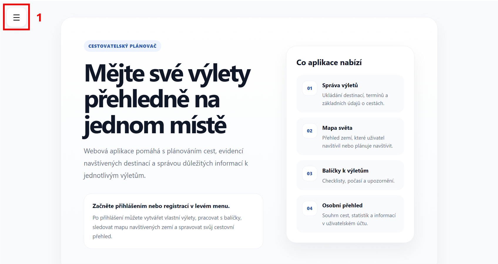
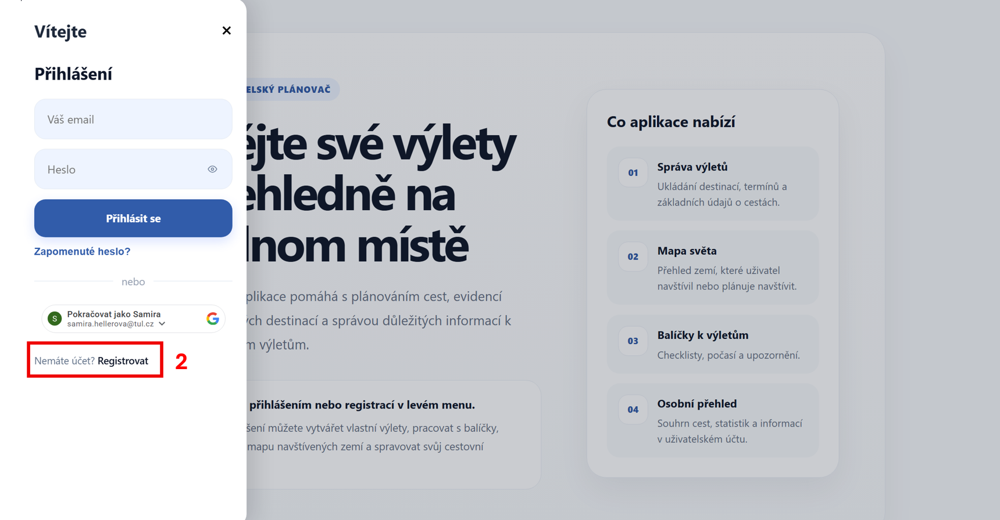
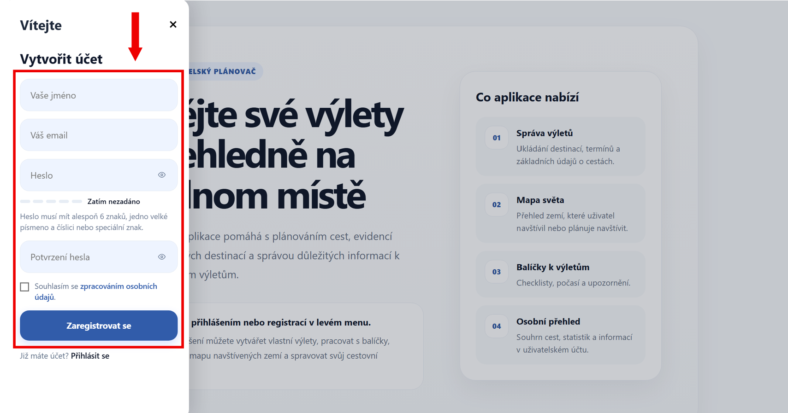
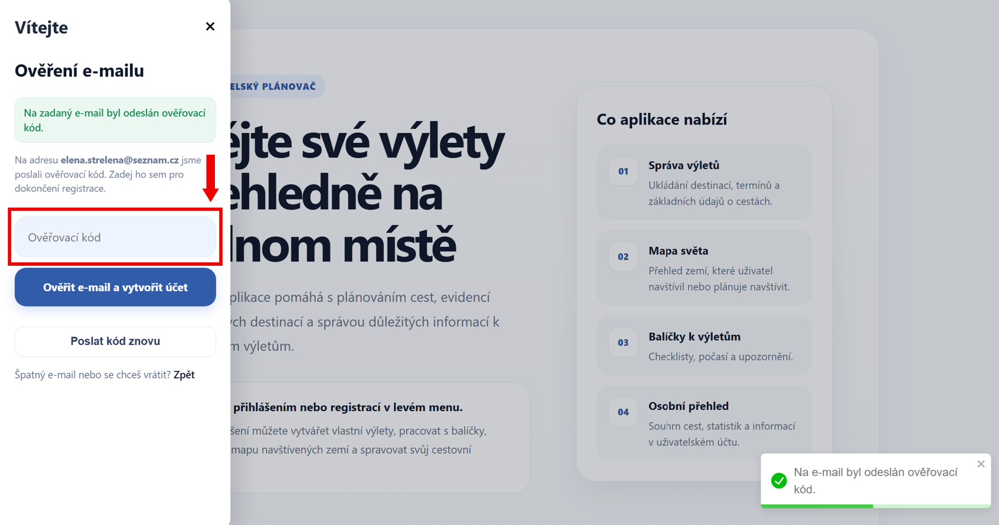
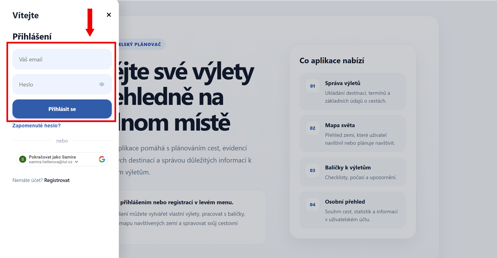
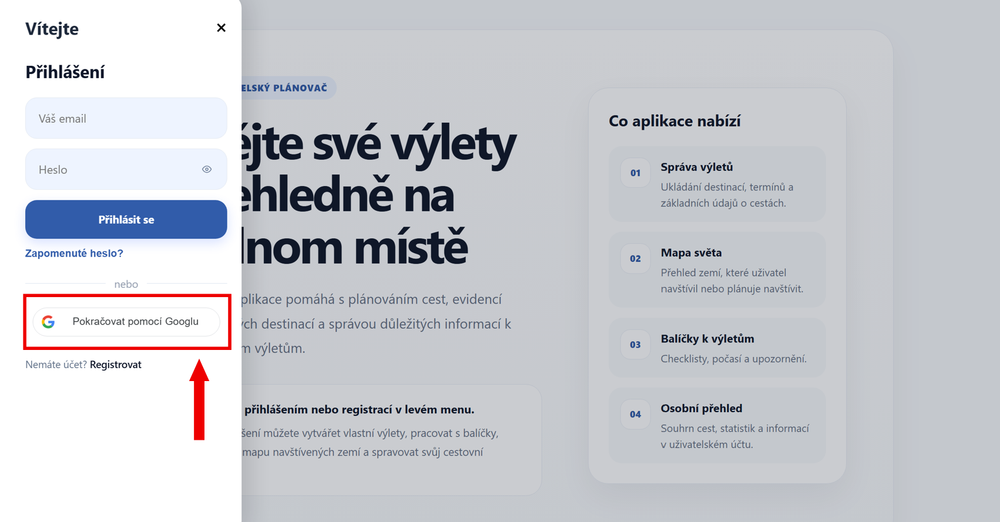
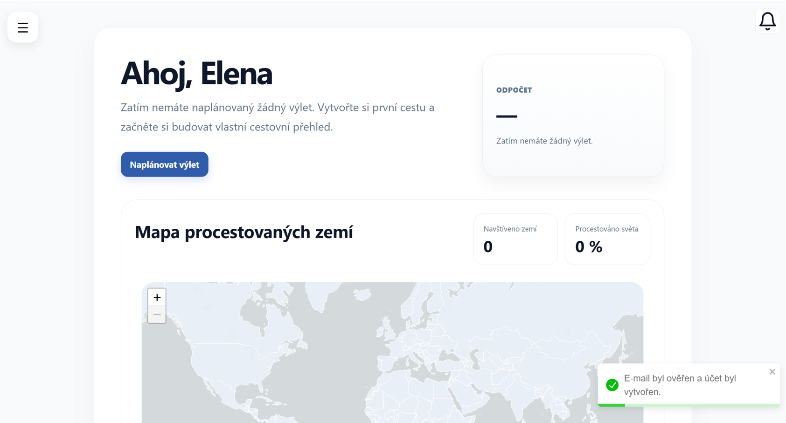

# Registrace a přihlášení

Abyste mohli aplikaci plnohodnotně používat, nejprve se přihlaste nebo si vytvořte účet.

Máte několik možností, jak na to:

- Nemáte ještě účet? → [Registrace](#registrace)
- Už účet máte? → [Přihlášení](#prihlaseni)
- Chcete využít Google účet? → [Přihlášení pomocí Google účtu](#google)

---

## Registrace nového účtu {#registrace}

Otevřete hlavní menu na úvodní stránce aplikace.

Klikněte na možnost **Registrovat**.

---

Zobrazí se registrační formulář.

Vyplňte jednotlivá pole:

- **Vaše jméno** – zadejte jméno, pod kterým budete v aplikaci vystupovat
- **Váš e-mail** – zadejte svůj funkční e-mail, který použijete pro přihlášení
- **Heslo** – zvolte bezpečné heslo (alespoň 6 znaků, velké písmeno a číslo nebo speciální znak)
- **Potvrzení hesla** – zadejte heslo znovu pro kontrolu
- **Souhlas se zpracováním osobních údajů** – pro dokončení registrace jej zaškrtněte

Akci potvrďte tlačítkem **Zaregistrovat se**.

!!! info ""
    Pokud některé pole nebude vyplněno správně, aplikace Vás na to upozorní.

---

Po odeslání formuláře Vám přijde na e-mail ověřovací kód.

---

## Ověření e-mailu

Otevřete svou e-mailovou schránku (zkontrolujte také složku **spam** nebo **hromadnou poštu**) a zkopírujte obdržený kód.

Vložte jej do formuláře a klikněte na **Ověřit e-mail a vytvořit účet**.

Po úspěšném ověření je účet aktivní a můžete se přihlásit.

!!! tip "Problémy s ověřením"
    Kód nepřišel? Klikněte na **Poslat kód znovu**.

    Zadali jste špatný e-mail? Klikněte na **Zpět**.

---

## Přihlášení {#prihlaseni}

Máte účet vytvořený? **Přihlaste se!**

Otevřete menu a vyplňte přihlašovací údaje:

- **Váš e-mail** – zadejte e-mail použitý při registraci
- **Heslo** – zadejte své heslo

Klikněte na tlačítko **Přihlásit se**.

!!! info ""
    Pokud zadáte nesprávné údaje, aplikace Vás na to upozorní.

---

## Přihlášení pomocí Google účtu {#google}

Používáte Google účet?

1. Klikněte na tlačítko **Pokračovat pomocí Googlu**
2. Vyberte svůj účet
3. Potvrďte přihlášení

---

Po úspěšném přihlášení budete automaticky přesměrováni do aplikace.

