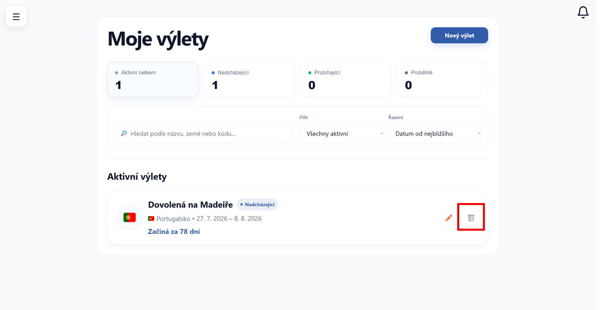
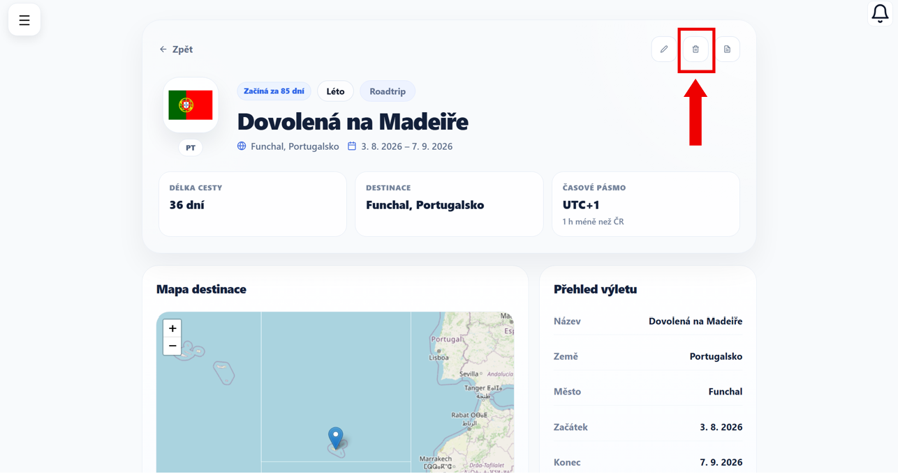

# Smazání výletu

V této části si ukážeme, jak odstranit výlet z aplikace.

---

## 1. Otevření možnosti smazání

Nejprve přejděte na stránku → [Moje výlety](moje-vylety.md)

U vybraného výletu klikněte na ikonu **smazat** (koš).

*Výlet je možné smazat také přímo z jeho detailu pomocí stejné ikony v pravé horní části obrazovky.*

---

## 2. Potvrzení smazání

Po kliknutí se zobrazí potvrzovací okno.

Zde si můžete ještě jednou zkontrolovat, zda chcete výlet opravdu odstranit.

Klikněte na tlačítko **Smazat** pro potvrzení.

---

!!! warning "Pozor"
    Smazání výletu je nevratné.

    Po odstranění již nebude možné výlet obnovit ani získat zpět jeho data.

---

## 3. Výsledek

Po potvrzení bude výlet trvale odstraněn ze seznamu.

V přehledu výletů se již nebude zobrazovat.