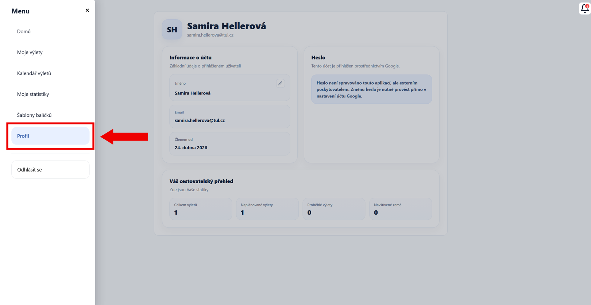
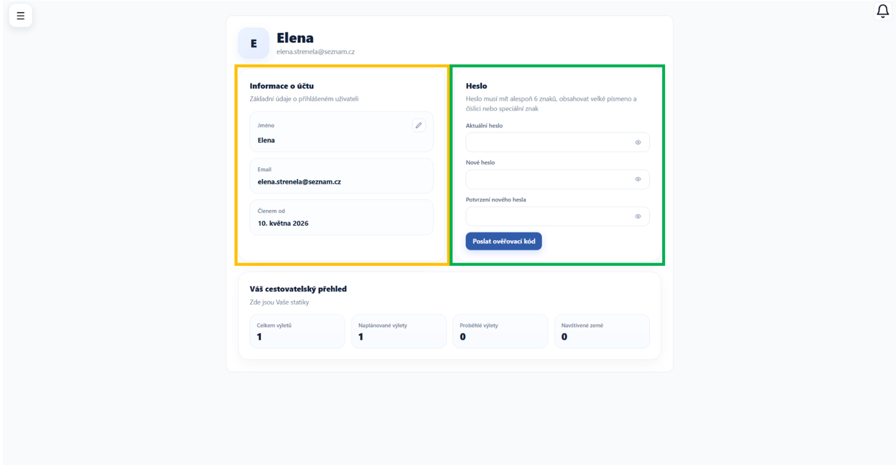
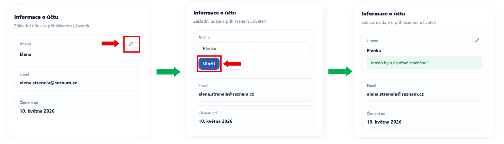
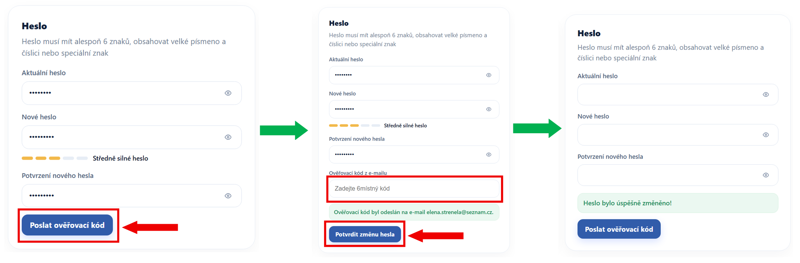
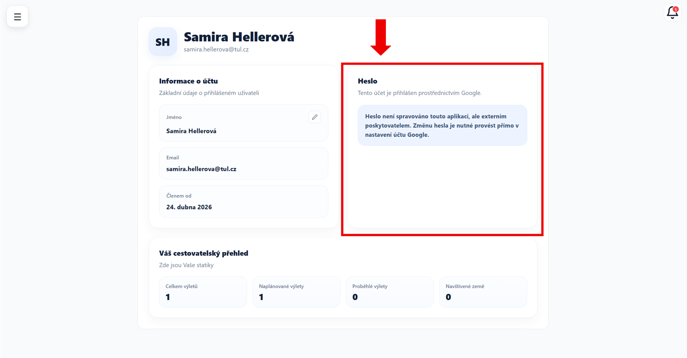

# Profil

Na této stránce spravujte svůj uživatelský účet.

Dostanete se sem přes hlavní menu aplikace, konkrétně pomocí záložky **Profil**.

---

## Rozvržení stránky

Stránka je rozdělena do několika sekcí.

---

### Informace o účtu

V **levé části** stránky (oranžově zvýrazněná oblast) se zobrazují základní informace o Vašem účtu:

- **Jméno** – uživatelské jméno
- **E-mail** – e-mail, pod kterým jste přihlášeni
- **Členem od** – datum, kdy jste se do aplikace zaregistrovali

---

### Úprava jména

Klikněte na ikonu **tužky**.
Proveďte potřebnou změnu a potvrďte ji tlačítkem **Uložit**.

---

### Změna hesla

V **pravé části** stránky (zeleně zvýrazněná oblast) použijte formulář pro změnu hesla.

Vyplňte:

- **Aktuální heslo** – současné heslo
- **Nové heslo** – nové heslo
- **Potvrzení nového hesla** – nové heslo znovu

Klikněte na tlačítko **Poslat ověřovací kód**.

Na e-mail Vám přijde kód, kterým změnu potvrdíte.

---

!!! warning "Důležité"
    Zvolte nové heslo tak, aby splňovalo bezpečnostní požadavky (minimální délka, velké písmeno, číslo nebo speciální znak).

---

### Používáte přihlášení přes Google?

Změnu hesla v aplikaci neprovádějte. Heslo je spravováno externě.

Změňte jej přímo v nastavení svého Google účtu.

