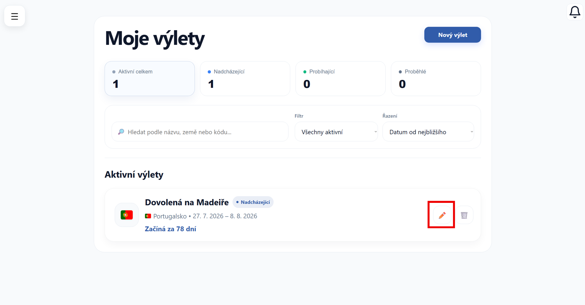
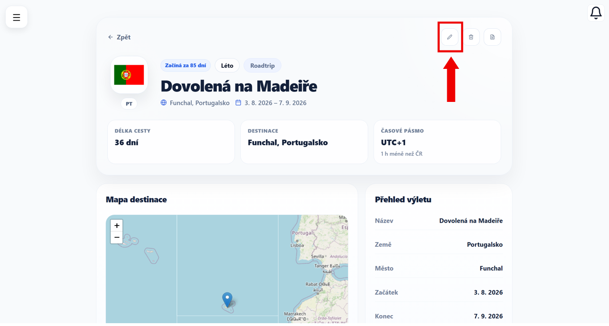
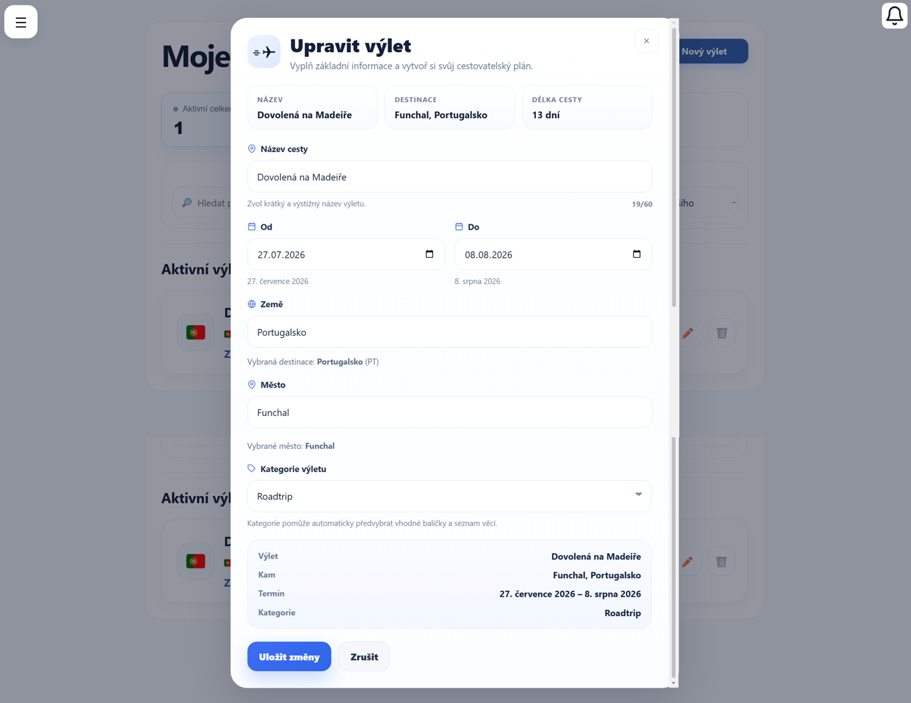
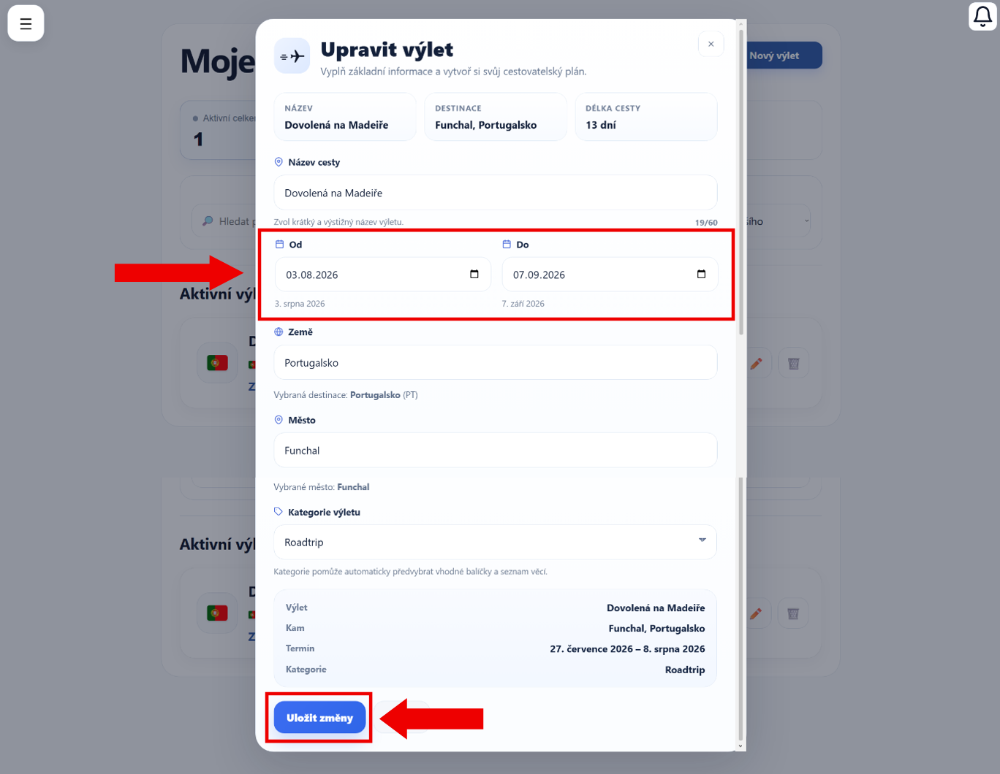
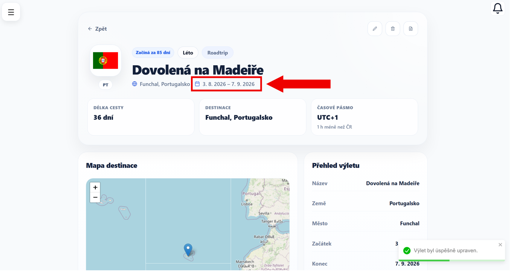

# Úprava výletu

V této části si ukážeme, jak upravit již vytvořený výlet.

---

## 1. Otevření úpravy výletu

Nejprve přejděte na stránku → [Moje výlety](moje-vylety.md)

U vybraného výletu klikněte na ikonu **upravit** (tužka).

*Výlet je možné editovat také přímo z jeho detailu pomocí stejné ikony v pravé horní části obrazovky.*

---

## 2. Úprava údajů

Zobrazí se formulář, který je velmi podobný tomu při vytváření výletu.

Kliknutím na požadované pole proveďte patřičné změny:

- **Název cesty**
- **Datum od / do**
- **Zemi a město**
- **Kategorii výletu**

!!! tip "Tip"
    Pokud změníte kategorii výletu, doporučené balíčky se automaticky upraví.

---

## 3. Uložení změn

Pokud jste upravili, co jste potřebovali, klikněte na tlačítko **Uložit změny**.

Jsou-li všechny údaje v pořádku, změny se uloží.

---

## 4. Výsledek

(Nejen) v detail výletu uvidíte aktualizované informace.

!!! info "Důležité"
    Změny se projeví okamžitě a jsou uloženy k vašemu účtu.