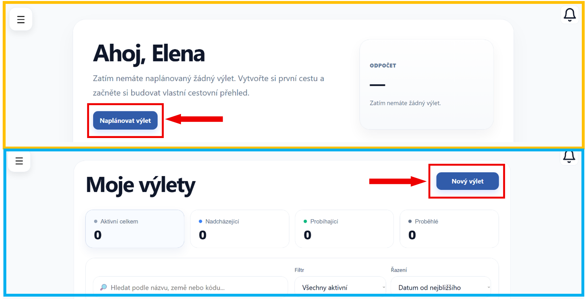
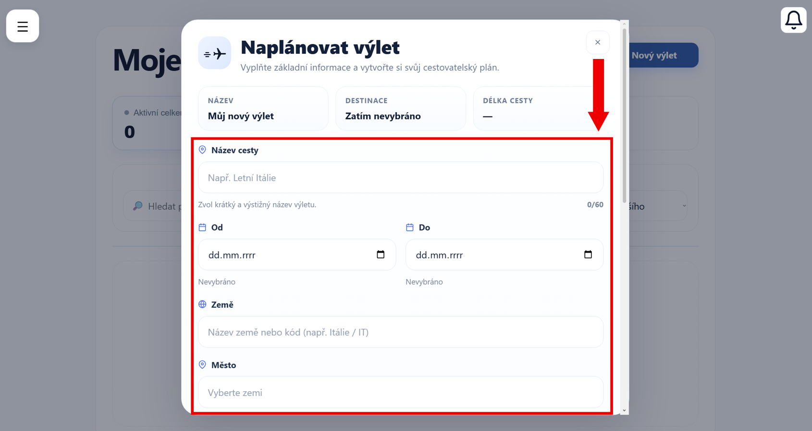
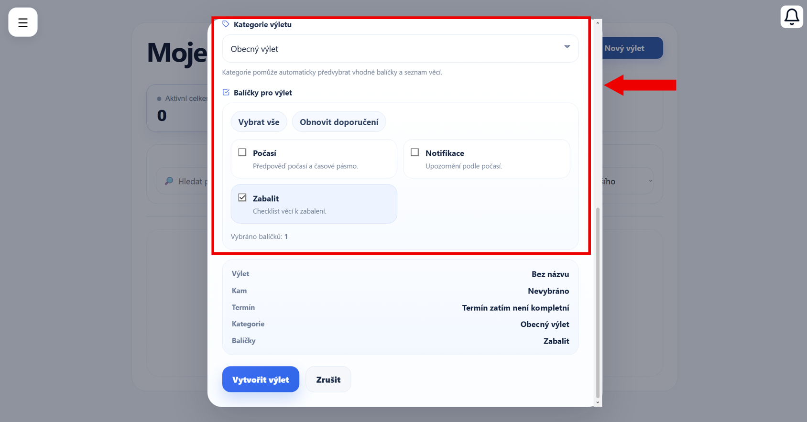
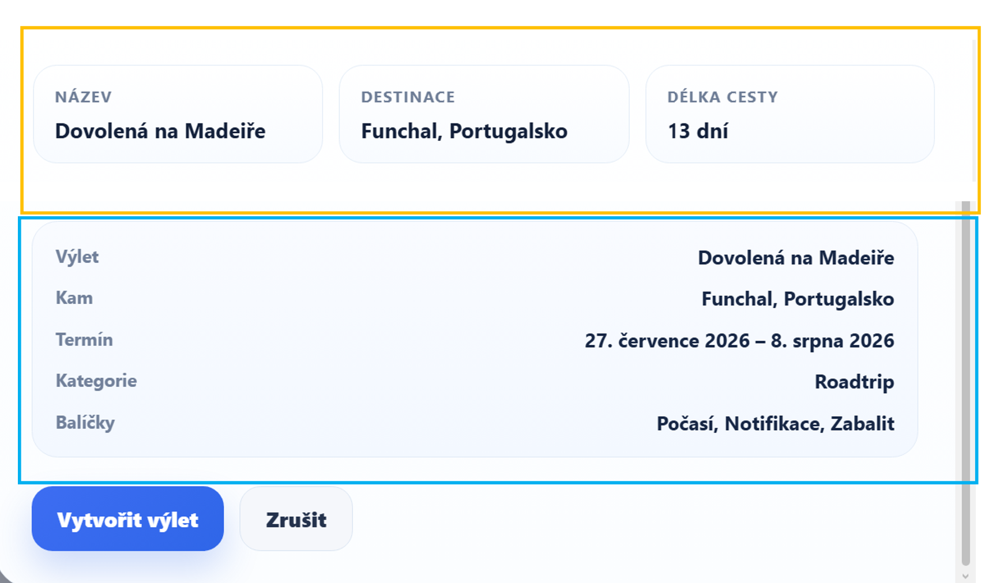
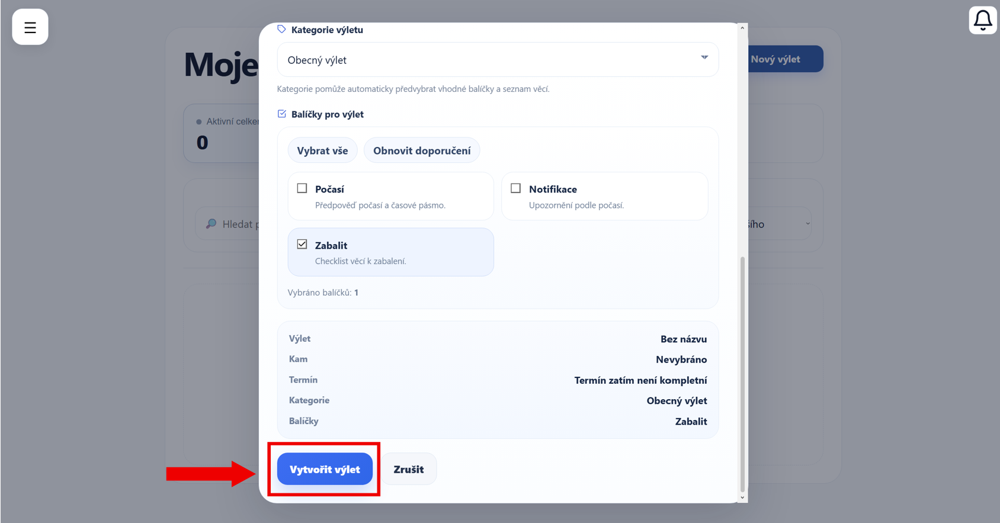

# Vytvoření výletu

V této části si ukážeme, jak vytvořit nový výlet.

---

## 1. Formulář pro vytvoření výletu

K vytvoření nového výletu se můžete dostat dvěma způsoby:

- **Z domovské stránky** – tlačítko pro vytvoření výletu je umístěno v horní části obrazovky (oranžově zvýrazněná oblast)

- **Ze stránky „Moje výlety“** – tlačítko se nachází v pravé části stránky (modře zvýrazněná oblast)

---

## 2. Vyplnění formuláře

Ať už zvolíte jakýkoliv způsob, v obou případech se zobrazí stejný formulář.

Vyplňte jednotlivá pole:

- **Název cesty** – zadejte název, pod kterým výlet snadno poznáte
- **Datum od** – vyberte den, kdy Váš výlet začíná
- **Datum do** – zadejte datum návratu
- **Země** – vyberte stát, do kterého se chystáte
- **Město** – zadejte konkrétní město

!!! tip "Tip"
    Doporučujeme zadat co nejpřesnější údaje o destinaci (stát a město), aby bylo možné správně zobrazit počasí a polohu na mapě.

Po vyplnění základních údajů pokračujte níže.

- **Kategorie výletu** – vyberte typ výletu, který nejlépe odpovídá Vašemu plánu

- **Balíčky pro výlet** – zvolte doplňkové funkce, které chcete využívat

    - **Počasí** – zobrazí předpověď počasí a časové pásmo
    - **Notifikace** – upozornění související s výletem
    - **Zabalit** – checklist věcí, které si vzít s sebou

- *Vybrat vše – aktivuje všechny dostupné balíčky*
- *Obnovit doporučení – nastaví balíčky podle zvolené kategorie*

!!! info "K čemu vlastně kategorie a balíčky slouží?"
    Výběr kategorie a balíčků ovlivňuje, jaké funkce budou ve výletu dostupné.

    Některé balíčky se mohou automaticky doporučit podle typu výletu.

---

## 3. Kontrola údajů

Při vyplňování formuláře aplikace automaticky kontroluje zadané údaje.

!!! warning "Omezení při vyplňování"
    - Název výletu musí být vyplněn (min. 3 znaky)
    - Datum začátku nesmí být později než datum konce
    - Maximální délka výletu je omezena
    - Některá pole jsou povinná

Pokud některý údaj není správný, aplikace Vás na to upozorní a výlet nebude možné uložit.

---

Možná jste si všimli, že formulář obsahuje také souhrn zadaných informací.

V horní části (oranžově zvýrazněná oblast) se zobrazuje rychlý přehled - název výletu, destinace a délka cesty.

Ve spodní části (modře zvýrazněná oblast) je pak detailnější shrnutí všech zadaných údajů.

---

## 4. Uložení výletu

Po vyplnění formuláře klikněte na tlačítko **Vytvořit výlet**.

Své vytvořené výlety najdete na stránce → [Moje výlety](moje-vylety.md)
