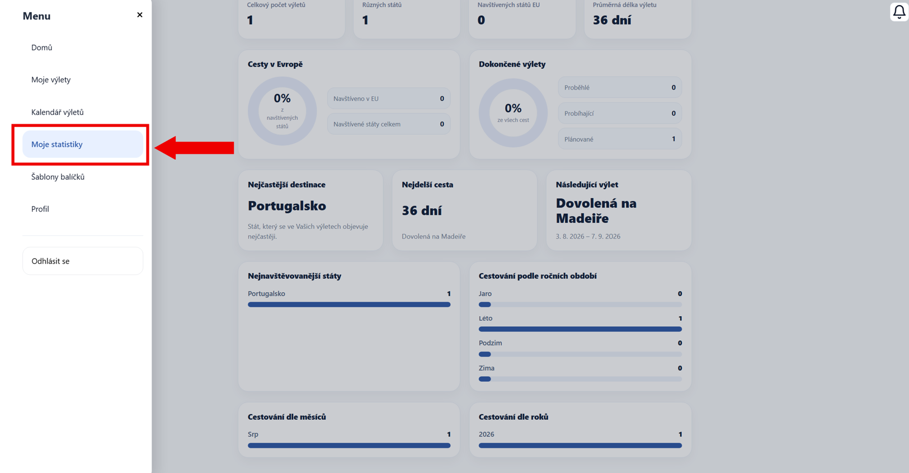
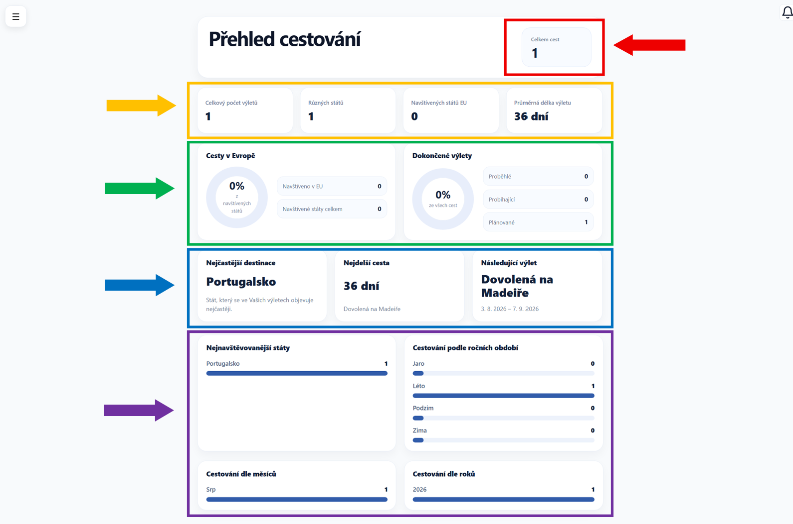

# Statistiky

Na této stránce najdete několik grafů, které zobrazují Váš cestovní přehled.

Dostanete se na ni přes hlavní menu aplikace, konkrétně pomocí záložky **Statistiky**.

---

## Rozvržení stránky

---

### Celkový přehled

V **pravé horní části** stránky (červeně zvýrazněná oblast) sledujte celkový počet výletů.

---

### Základní statistiky

Hned **pod ním** (oranžově zvýrazněná oblast) se nachází souhrn základních údajů:

- **Celkový počet výletů** - kolik máte celkem výletů
- **Různých států** - kolik různých států jste navštívili
- **Navštívených států EU** - kolik z nich je v rámci EU
- **Průměrná délka výletu** - jak dlouhé jsou průměrně Vaše cesty

---

### Přehled cest

Ve **střední části** stránky (zeleně zvýrazněná oblast) najdete podrobnější informace:

- **Cesty v Evropě** - kolik procent Evropy jste navštívili
- **Dokončené výlety** - kolik výletů máte:
    - proběhlých
    - probíhajících
    - plánovaných

---

### Zajímavosti o výletech

**Níže** (modře zvýrazněná oblast) najdete:

- **Nejčastější destinace** - kam jezdíte nejčastěji
- **Nejdelší cesta** - jak dlouho trval Váš nejdelší výlet
- **Následující výlet** - jaký je nejbližší plánovaný výlet

---

### Detailní statistiky

Ve **spodní části** stránky (fialově zvýrazněná oblast) najdete přehledy:

- **Nejnavštěvovanější státy** - které státy navštěvujete nejčastěji
- **Cestování podle ročních období** - v jakém ročním období nejvíce cestujete
- **Cestování dle měsíců** - počet výletů v jednotlivých měsících
- **Cestování dle roků** - počet výletů v jednotlivých letech

---

!!! tip "Tip"
    Sledujte své statistiky průběžně - čím více výletů přidáte, tím zajímavější a přesnější přehled získáte!